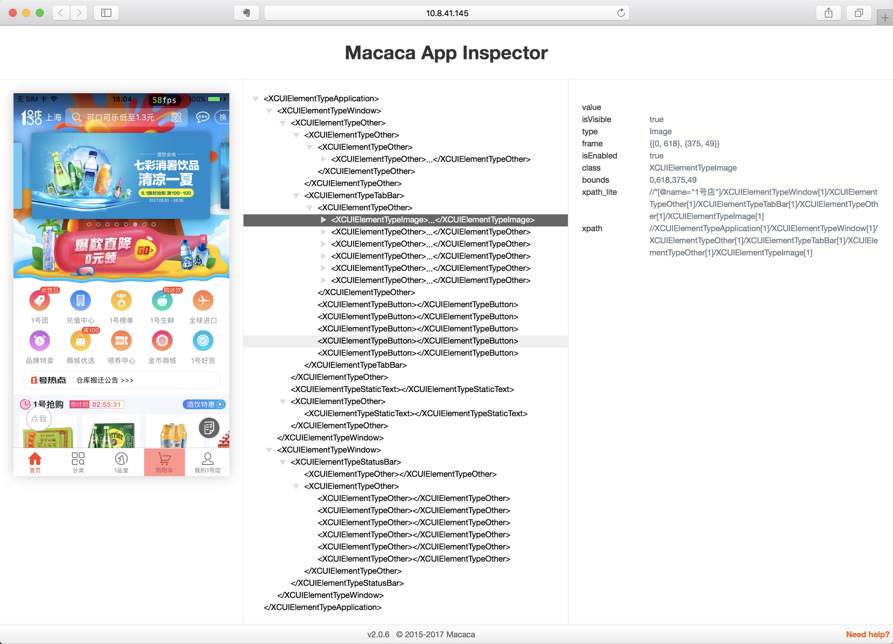

# Mac自动化环境搭建
>* 工具原料
>
	* [Homebrew](https://brew.sh/)
	* [Java](https://www.java.com/zh_CN/download/mac_download.jsp)（1.8.0 及以上）
	* Xcode（8.0 及以上版本）
	* IDE（Eclipse, [Intellij](https://www.jetbrains.com/idea/download/#section=mac) 或其他 Java IDE） 
	* [Appium - Desktop](smb://192.168.8.8/CrossShare/前台/Appium/Appium-1.2.0-beta.1.dmg)（1.1.0 及以上版本, 可选）
	* iPhone（iPhone 6 及以上机型, 10.0 及以上系统 ）
* 基础工作
	* 运行```java -version```查看 java 版本是否满足最低要求, 自行升级
	* 运行```xcode-select --install```安装 ```Xcode Command Line Tool```（已安装则跳过）
	* 下载脚本 [bootstrap.sh](http://iosgitlab.com/autotest/Appium/tree/develop/Auto_iOS/script)（运行脚本需要升级 brew, 可根据脚本提示选择是否手动升级; ```bash bootstrap.sh -h```可获取脚本详细信息, 包括参数说明、所需安装依赖工具等其他注意事项)
* 注意事项
	* 自动化环境分为两种版本（针对日常的的自动化需求只需构建 GUI 版本即可）
		1. GUI（图形界面）版本, 集成了图形化的工具, 便于编写用例及调试（推荐版本）
		2. CLI（命令行界面）版本, 使用命令行启动服务, 便于集成自定义脚本
	* 运行脚本安装依赖环境和配置 WebDriverAgent 均须联接网络
	* Inspect 是查看App界面的辅助工具, 用于日常调试时的元素捕获定位, 文档中关于调试 Inspector 的步骤除帮助熟悉配置并使用这个工具外, 对于自动化环境的构建, 能成功运行 Inspector 查看界面元素也是环境构建完成的最终标志
	* Java IDE 需集成单元测试工具 JUnit（Eclipse默认集成, Intellij一般也默认集成，在编写用例过程中如无单元测试按钮自行安装插件）
* 配置依赖环境
	* [**GUI**](#anchor-gui)（**推荐**）
	* [**CLI**](#anchor-cli)
* [**编写测试用例**](#anchor-code)
* [**FAQ**](#anchor-faq)

## <a name="anchor-gui"></a>GUI
>* 运行脚本 ```bash bootstrap.sh -d```安装 GUI 依赖环境
* 运行```appium-doctor --ios```检查环境是否安装正确
* 安装 [Appium](https://github.com/appium/appium-desktop/releases/tag/v1.1.0)
* 配置 WebDriverAgent
	1. 进入 WebDriverAgent 根目录 (```cd /Applications/Appium.app/Contents/Resources/app/node_modules/appium/node_modules/appium-xcuitest-driver/WebDriverAgent```, 根据 Appium.app 安装路径调整命令)
	2. 配置 [**WebDriverAgent**](#anchor-wda)
* 调试 [**Appium Inspector**](#anchor-appium_inspector)

## <a name="anchor-wda"></a> WebDriverAgent
1. 使用 Xcode 打开```WebDriverAgent.xcodeproj```, 选择编译目标机器, 修改 ```WebDriverAgentLib -> Bundle Identifier``` : ```com.facebook.WebDriverAgentLib``` 为 ```com.xxx.WebDriverAgentLib``` 其他ID, 勾选 ```Automatically manage singing``` 使用个人账号 team, 保证此处不产生编译错误

2. 先修改 ```WebDriverAgentRunner -> Build Setting -> Product Bundle Identifier``` : ```com.facebook.WebDriverAgentLib``` 与上步相同, 之后勾选 ```Automatically manage signing``` 使用个人账号 team, 保证此处不产生编译错误


## <a name="anchor-appium_inspector"></a> Appium Inspector
1. 启动 Appium 服务端

2. 建立 Session

3. 选中```Automatic Sercer```配置并开启 Session（左侧为真机配置, 右侧为模拟器配置。需要注意的是模拟器配置需要给定具体的机型和对应的版本号, 可运行```instruments -s```查看

4. 运行成功（GUI 环境构建完成）


## <a name="anchor-cli"></a>CLI
>* 运行脚本 ```bash bootstrap.sh -d```安装 CLI 依赖环境
* 运行```appium-doctor --ios```检查环境是否安装正确
* 配置 WebDriverAgent
	* 进入 WebDriverAgent 根目录 (```cd /usr/local/lib/node_modules/appium/node_modules/_appium-xcuitest-driver@2.41.0@appium-xcuitest-driver/WebDriverAgent```, 根据安装路径调整命令)
	* 配置 [**WebDriverAgent**](#anchor-wda)
* 配置 app-inspector
	* 进入 app_inspector 根目录（```cd /usr/local/lib/node_modules/app-inspector/node_modules/xctestwd/XCTestWD```, 根据安装路径调整命令）
	* 配置 [**app-inspector**](#anchor-app_inspector)
* 启动服务
	* 运行```appium -p 4723```

## <a name="anchor-app_inspector"></a> app-inspector
1. 使用 Xcode 打开```XCTestWD.xcodeproj```, 选择编译目标机器, 修改 ```XCTestWD -> Bundle Identifier``` : ```XCTestWD.XCTestWD``` 为 ```xxx.XCTestWD``` 其他ID, 勾选 ```Automatically manage singing``` 使用个人账号 team, 保证此处不产生编译错误

2. 修改 ```XCTestWDUITests -> Build Setting -> Product Bundle Identifier``` : ```XCTestWD.XCTestWD``` 与上步相同, 勾选 ```Automatically manage signing``` 使用个人账号 team, 保证此处不产生编译错误

3. 运行```app-inspector -u 真机UDID```（CLI环境构建完成）


## <a name="anchor-code"></a> 编写测试用例
* 拉取[代码](http://iosgitlab.com/autotest/Appium)
* 用 IDE 打开工程

* 修改```Auto_iOS/config/config.properties```文件配置, 一般只需修改 deviceCode, 即真机 UDID

* 如需模拟器运行，则注释 deviceCode, 填写相应 .app 文件路径

* 编写测试用例进行调试


## <a name="anchor-faq"></a> FAQ
* **Q :** 启动 Appium Server 后进行 Inspectior 调试的候日志显示```xcodebuild exited with code '65' and signal 'null'```
	* **A :** 此类问题原因很多, 但是度可以归结为 WebDriverAgent 的编译问题。例如工程证书签名报错或者没有在真机上信任证书。解决方法: 
		* 保证网络联接正常
		* 进入 WebDriverAgent 根目录, 并在当前目录下执行```xcodebuild -project WebDriverAgent.xcodeproj -scheme WebDriverAgentRunner -destination 'id=真机UDID' clean test```（替换 id 为相应参数）（或者用 Xcode 打开```WebDriverAgent.xcodeproj```选择真机执行```command + U```操作）在真机上 Test。根据日志信息进行修复直到成功为止，关闭进程。
		* 如果日志提示证书验证失败, 在手机上进入```设置 -> 通用 -> 描述设备与设备管理```选择相应的证书进行认证（手机保持联网状态）并再次进行同样的 Test 操作
		
* **Q :** 运行 app-inspectort 报错，浏览器显示 ```Internal Server Error```
	* **A :** 此类问题一般为 app-inspectort 编译问题, 解决方法:
		* 进入 app-inspector 根目录, 并在当前目录下执行```xcodebuild -project XCTestWD.xcodeproj -scheme XCTestWDUITests -destination 'id=真机UDID' XCTESTWD_PORT=8001 clean test```（替换 id 为相应参数）（或者用 Xcode 打开```XCTestWD.xcodeproj```选择真机执行```command + U```操作）在真机上 Test。根据日志信息进行修复直到成功为止，关闭进程。

* **Q :** 打开自动化代码工程后代码大面积报错, 编译器提示 ```Project SDK is not defined```, 进行单元测试出现下图警告

	* **A :** 此类问题一般为工程的 Java SDK 路径错误, 解决方法:
		1. 选择 ```File -> Project Structure```
		
		2. 选择 Java SDK, 如果选项中没有 SDK, 则原因是没有设置 Java Home 路径, 选择 ```New```, 添加 Java SDK, 路径为```/Library/Java/JavaVirtualMachines/jdk1.8.0_131.jdk/Contents/Home```, 路径会因为版本而稍有不同
		
		3. 保存设置再次运行
* **Q :** 已经安装了最新的 Java 版本, 运行```java -version```却依然显示旧版本号
	* **A :** 假设 Java 版本为 1.6, 操作如下:
	
		```
		sudo mv /usr/bin/java /usr/bin/java-1.6
		
		sudo ln -s '/Library/Internet Plug-Ins/JavaAppletPlugin.plugin/Contents/Home/bin/java' /usr/bin/java	
		```		 
		如上步遭遇 Operation not permitted 错误, 重启电脑, 开机时按```command + R```组合快捷键, 进入恢复模式, 打开Terminal输入命令后重启, 重复上步
		
		```
		csrutil disable

		```
		
		可用同样的方式 enable csrutil
		

		```
		csrutil disable

		```
		