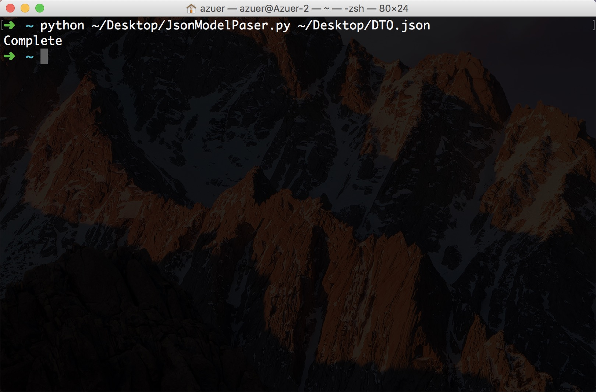
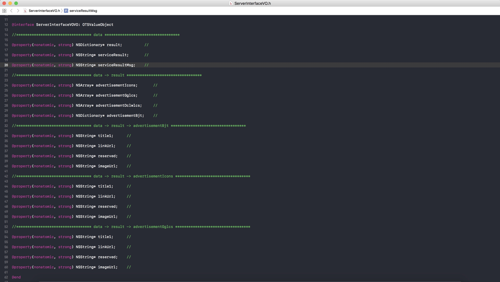
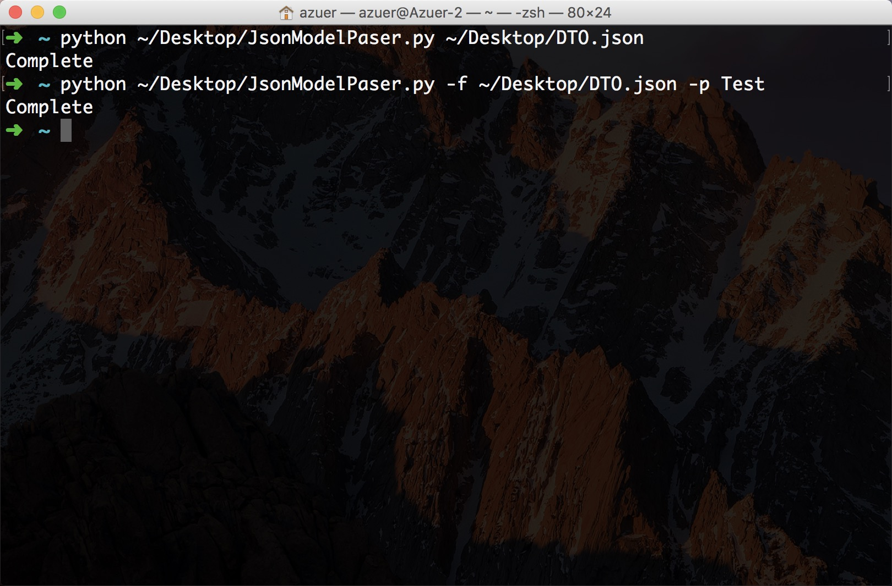
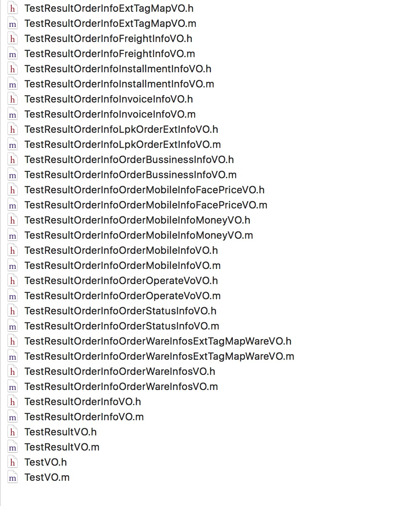

# JsonModelParser

* ####描述
	* 将服务器返回的 json 中的 data 数据转换为 objective-c 的 ValueObject
	
		
* ####参数 (-f 指定目标路径 -p 指定生成文件名前缀)
	* ```[-f]``` : ```python jsonModelParser.py [-f] path```
	* ```-f -p``` :	```python jsonModelParser.py -f path -p prefix```
* ####参数说明 
	* ```JsonModelPaser``` 会根据参数生成不同的文件格式，当只传入文件路径时，即 ```python jsonModelParser.py [-f] path``` (```[-f]``` 为可选)，```JsonModelPaser ``` 会将所有嵌套的数据生成到同一个 ```.h``` 文件中并用 ```“*”``` 号分割，如图1
	* 如果需要为不同的嵌套数据生成不同的 ```.h``` 文件需要显式指定文件路径以及根文件前缀，即 ```python jsonModelParser.py -f path -p prefix```

* ####备注
	* 生成的 ```property``` 会以长度升序
	* 只指定文件路径时只生成 ```~DeskTop/ServerInterfaceVO.h``` 文件
	* 同时指定 ```-f -p``` 参数时会在 ```~DeskTop/VO``` 文件下生成已 ```-p``` 参数指定前缀名的相应文件，如图2
	* 服务器数据格式

			{
				"rtn_tip": "",
				"rtn_msg": "",
				"rtn_ftype": "",
				"rtn_ext": "操作成功",
				"data": {},
				"rtn_code": "0",
				"clientIp": "00.00.00.00"
			}
			
* ####图示
		
	
	
	
