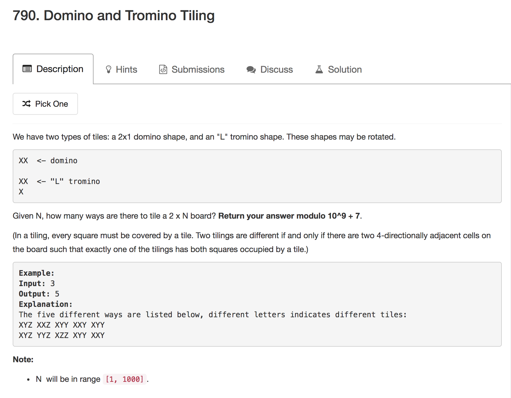
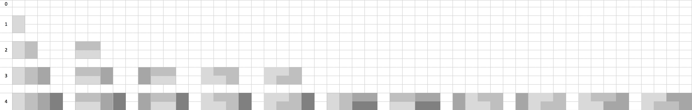
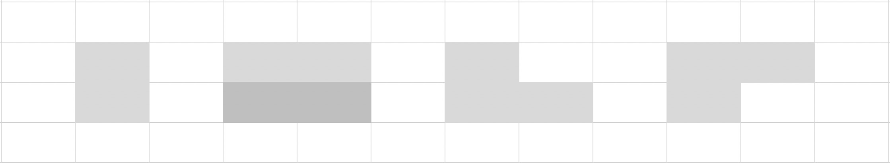
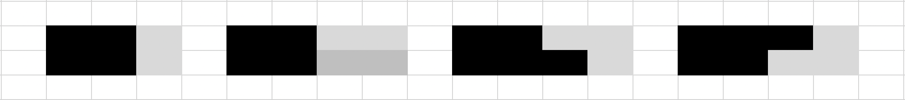
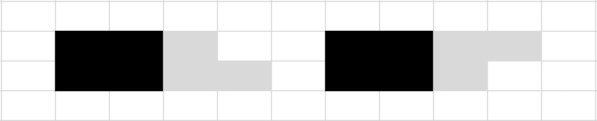
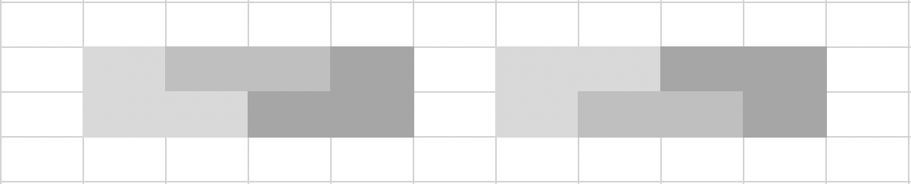

#记一次动态规划(dynamic programming, DP)的解题过程

##前言

写本文的动机是想谈谈近期学习动态规划的一些心得体会，记录一下学习路径顺便推荐一些优秀的博文，抛砖引玉，为之后想要学习的朋友做一点简单的总结指引。本文原计划从一个简单的DP问题入手来谈谈近期的学习心得，然后引申到**背包问题、阶梯问题**并做一个简单的入门讲解，但是在行文过程中发现笔者写作水平有限，很多想法表达不够直白，相较之后推荐的博文，难免有画蛇添足之嫌，贻笑大方，于是在解题过程中穿插一些想法。错误在所难免，望大家指正。接下来进入正题。

##题目：[Leetcode 790. Domino and Tromino Tiling](https://leetcode.com/problems/minimum-ascii-delete-sum-for-two-strings/description/)


<center>图1</center>
题意：
给定 **N**，有多少种方式可以铺满 **2xN** 的格子？将结果模 **10^9+7** 返回。
分别有两种铺法：`L` 型和 `-` 型。
##分析

>这是动态规划题目中典型题目里的一种——**铺砖问题**。此外还有**背包问题、阶梯问题以及衍生的切割问题**等。

DP问题的求解思路是比较明确的，通过审题总结出递推公式，然后根据初始条件通过迭代计算得出正解，即求解DP问题的通用范式：**最优子结构 + 状态转移方程 + 边界条件**。

回到本文主题，对于铺砖问题，说难也难说简单也简单，难的是找出最优子结构，因为如果对DP问题了解的不多的话，列举各个阶段的解并找出之间的规律经常让人无从下手；简单的是对于此类问题的解法比较固定，规律找多了也就有经验了，熟悉之后对于大部分中难度的DP问题可以说是一马平川。

对于本文所要求解的问题，先列举出前5个阶段来总结规律, 如图2：(图中隐含了递推规律，可对照图示先行推导)

<a name="anchor1"></a>
<center>图2</center>

如题所述，对于`-`型和`L`型铺法，各有两种铺法，其中`-`型分为 `-`和`|`分别占1列和2列，而`L`型的两种铺法对称，都占两列，如图3：


<center>图3</center>

所以不难看出，要铺满 2xN 的格子，我们有三种方式:

1. 铺满 **2x(N-1)** 的格子然后用`|`铺满最后一列；
2. 先铺满 **2x(N-2)** 的格子然后用`-`铺满最后两列；
3. 用`L`型刚好铺满。

如果是前两种情况，那么子问题也是完整的被铺满，而第三种情况则不是，因为只有两个对称的`L`型才能完整的契合。如图4：(黑色表示所有可铺满的情况)


<center>图4</center>

这样我们就找到了最优子结构，因为要区分子问题是否已经铺满，所以用一个二维数组来表示：

* 定义 **f[i][j]** 表示铺满 **2xi** 格子时还有 **j** 个格子被铺满的解，那么 **j** 只有两种取值 **0** 和 **1**，即 **f[i][0]** 表示刚好铺满 **2xi** 格子的解，**f[i][1]**表示铺满 **2xi** 格子之后又多铺了 **i+1** 列中的一个格子，也就是以`L`型结尾的情形。

那么 **f[i][0]** 将由三部分子解组成，写出递推公式：

```
f[i][0] = f[i-1][0] + f[i-2][0] + f[i-2][1]

```
加上边界条件
>容易理解，对于 **N=0**，铺满 **2x0** 格子的方案只有一种就是不铺。不存在铺满 **2x0** 格子且多铺1格子的方案，所以为 **0** ；对于 **N=1**，铺满 **2x1** 格子的方案只有一种，用`|`即可铺满，而用`L`型即可得到两种铺满 **2x1** 格子且多铺一格的方案。

```
f[0][0] = 1, f[0][1] = 0
f[1][0] = 1, f[1][1] = 2
```

观察递推公式：`f[i][0] = f[i-1][0] + f[i-2][0] + f[i-2][1]`

其中`f[i-1][0] + f[i-2][0]`便是所求解的子解，有了初始的边界条件便能容易得推出，所以问题主要在 **f[i][1]** 的推导，很容易便能想到这两种对称的情形，即`f[i][1] = f[i-1][0]*2`，也就是说 **f[i][1]** 可由 **f[i-1][0]** 和两个对称的`L`型拼成，如图5：


<center>图5</center>

到这里，问题似乎得到了解决，剩下所要做的无非是将推导过程翻译成相应的代码，可当我们对推导出的状态转移方程做以简单的验证便却发现结果并不符合预期。

回到递推式：`f[i][0] = f[i-1][0] + f[i-2][0] + f[i-2][1]`

**思考:** 对于`-`型铺法，要么用只占一列的`|`铺设，要么用占两行两列的`-`铺设，这点毫无疑问，那么问题定是出在了`f[i][1]`的求解上。继续观察之前 [**图2**](#anchor1) 所例举的 **N <= 4** 的所有情形，由于用黑色填充省略了子问题的布局方式，可能导致我们遗漏了一些细节，将其展开后可以发现在 **N=4** 的时候多出了一种没有考虑到的```L```型，如图6:


<center>图6</center>

从上图可以看出，```L```型与```-```型也可以组成```L```型，此时```f[i][1] = f[i-1][1]```，可以解释为 **f[i][1]** 由 **f[i-1][1]** 加上`-`型拼成。需要注意的是，```f[i-1][1]```中隐含对称的情形，因此不需要乘 **2** 。
所以最终的状态转移方程为：

```
f[0][0] = 1
f[0][1] = 0
f[i][0] = f[i-1][0] + f[i-2][0] + f[i-2][1]
f[i][1] = f[i-1][0]*2 + f[i-1][1]
```
由递推公式写出部分递推过程：

```
f[0][0] = 1, f[0][1] = 0
f[1][0] = 1, f[1][1] = 2
f[2][0] = f[1][0] + f[0][0] + f[0][1] = 2,   f[2][1] = 4
f[3][0] = f[2][0] + f[1][0] + f[1][1] = 5,   f[3][1] = 8
f[4][0] = f[3][0] + f[2][0] + f[2][1] = 11,  f[4][1] = 18
f[5][0] = f[4][0] + f[3][0] + f[3][1] = 24,  f[5][1] = 40
f[6][0] = f[5][0] + f[4][0] + f[4][1] = 53,  f[6][1] = 88
f[7][0] = f[6][0] + f[5][0] + f[5][1] = 117, f[7][1] = 194
... ...
```
至此，完成求解。
***
Python 代码：

```python
class Solution(object):
    def numTilings(self, N):
        """
        :type N: int
        :rtype: int
        """
        if N < 1:
            return 0
        N += 1
        module = pow(10, 9)+7   
        dp = [[0, 0]*N for _ in range(N)]
        dp[0][0], dp[1][0], dp[1][1] = 1, 1, 2
        for i in range(2, N):
            dp[i][0] = dp[i-1][0] + dp[i-2][0] + dp[i-2][1]
            dp[i][1] = dp[i-1][0]*2 + dp[i-1][1]
        return dp[N-1][0] % module
```

>注意⚠️：可以看到最后的结果模 ```10^9 + 7```返回，也就是题目中加粗提到的**Return your answer modulo 10^9 + 7.**以防止整数溢出。本人由于没有认真审题，第一次提交没有AC，在排查的时候花费了不必要的功夫，因此也在这里提醒各位粗心的朋友，解题的前提是理解题目，本人在以往的工作学习中吃过很多亏，谨以为诫。

在本题的[讨论区](https://leetcode.com/problems/ones-and-zeroes/discuss/)下主流的解题思路与本文不同，在效率上本文的求解方式也只打败了可怜的8.5%的提交，然而本文的初衷是通过本题对DP建立一个初级的思考过程，效率问题不在讨论范畴之内，有兴趣的朋友可以自行学习。

#后记
其实对于铺砖问题乃至大部分的DP问题，主要的难点就是对问题的抽象以及状态的思考上，对于本文所求解的问题，按照直觉，用 **f(n)** 表示铺满 **2xn** 格子的解，只需要找出 **f(n)** 于**f(n-1),f(n-2)...** 的关系便可，而在实际思考过程中却发现需要多加一个纬度。当然对于本文所论述的题目来说这种改动相对而言比较自然直观，而对于一些较难的题目可能就没有那么显而易见。直接的翻译题目去求解很可能走进死胡同。这时候很可能需要换一种思路来曲线救国，让看起来纷繁复杂的问题变得直观简单。

对于本文所论述的问题，只需列举 N<=4 的情形便能找到规律，但这毕竟是后知后觉的做法，也就是说是在知道了答案再去论述求解过程。其实笔者在第一次思考这个问题的时候列举到了 **N<=6**，此时 `f[6][0]=53`，对于人肉枚举来说已经让人望而生畏。

通常，对未知状态恐惧的心理障碍是阻碍解题的第一道门槛。笔者认为归根到底是因为缺乏逻辑训练，对于问题的分析求解没有一个成体系的流程，所以希望大家在日常学习中多加思考，逐步形成自己的思维模式。


##一些推荐
本文求解的思路主要来源于 **夜深人静写算法（二） - 动态规划**[^index3] 这篇博文，其作者对DP问题的论述不论在深度还是广度上都有很深入的见解，有兴趣的朋友可以学习一下。

通过对大量DP问题学习总结可以发现，DP是一种**带备忘录的自底而上的递归求解思想**。当时理解这一点也是来自于这篇博文：**漫画：什么是动态规划？**[^index2]。作者讲的非常有趣，通过最简单的爬楼梯将递归求解一步步上升到DP问题，对于初学者有很大的帮助。

笔者在刚接触DP问题时，通常无从下手，茫然不知所措，在先后了解了**背包问题、阶梯问题以及铺砖问题**，才慢慢对动态规划有了一个感性的认识。尽管目前在做新题时也会纠结好久，但好在有了指导思想，大概知道前进的方向。在这里笔者推荐**背包九讲**[^index1]这篇在网络上广泛流传的博文,原作者对背包问题进行了一个全面的总结，对不同背包问题的讲解简单直接，各个章节篇幅不长，详细的理解前三章会让读者受益匪浅。读完后可通过[leetcode 474. Ones and Zeroes](https://leetcode.com/problems/ones-and-zeroes/description/)进行练习。

>需要注意的是在**背包九讲**中作者在 **1.5 一个常数优化** 一节中存在错误，本想联系下作者勘误，但是发现在github上有人已经提了[issue](https://github.com/tianyicui/pack/issues/5)，感兴趣的朋友也可以找找具体位置以验证是否真的理解了作者所要传达的思想。

#索引

[^index1]: [背包九讲](https://github.com/tianyicui/pack)

[^index2]: [漫画：什么是动态规划？](https://www.sohu.com/a/153858619_466939)

[^index3]: [夜深人静写算法（二） - 动态规划](http://cppblog.com/menjitianya/archive/2015/10/23/212084.html)